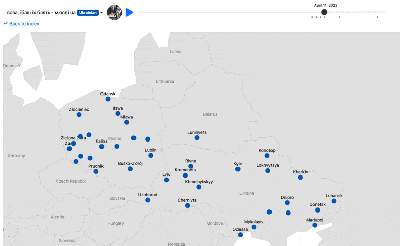

This repo contains code for the paper "**Music discovery patterns reveal cultural shifts following the 2022 Russian invasion of Ukraine**". To reproduce our analyses you will need some or all of these files.

> All data and materials are publicly archived at [OSF](https://osf.io/ra38k/?view_only=32795758b14040cdb826d743023308fd) (for peer review only link), with the exception of song metadata which belongs to the relevant right holders. All analysis scripts are available at <https://github.com/harin-git/mus-war>.

Please contact us if you run into any issues.

## Interactive visualizations

Interactive visualizations of figures in the paper can be found on [our website](www.musicdiscover.net)

## Downloading the data

To download the data, the helper function `download_data.R` allows to automatically fetch data from the OSF repository using the [osfr](https://cran.r-project.org/web/packages/osfr/vignettes/getting_started.html) R package. You can define which type of data to download, corresponding directories will be created, and the download process will begin.

You can also manually download the data from OSF by following [this link](https://osf.io/ra38k/?view_only=32795758b14040cdb826d743023308fd)

## Reproducing the analyses and plots

All analyses in the paper can be reproduced with the code posted here, in R and Python. Most of our computations are done using bootstrap simulations, which is often computationally costly to compute. Therefore, pre-computed bootstrap files are also available for downloaded by specifying `bootstrap_files = TRUE` using `download_data.R` . This will initiate in creating a directory called `/Boostraps` and download the bootstrap files.

When running all analysis and reproducing the figure, `SIMULATION` parameter in scripts can be set to `FALSE` to bypass the bootstrap computation. Given the bootstrap data is downloaded, it will fetch the pre-computed bootstrap outcomes.

All analyses scripts begin by loading study-wide packages and high level functions through `utils.R`. These packages included in the script needs to be first installed to fully reproduce all analyses. See file `session_info.txt` for full specification used by the researcher.

All visualizations are produced using `ggplot2`, with the exception of diffusion networks, which was visualized using [Gephi](https://gephi.org/). Some figure elements are augmented manually (e.g., adding some labels) and/or include illustrations.

To infer the diffusion network, [NETINF](https://snap.stanford.edu/netinf/) needs to be installed. Once installed and pointed to the right path, `Main1d,e-infer_diffusion_network.R` function can be used as a wrapper to augment the raw data and format the cascades as input to NETINF.

## Codebook

`nodeID` = unique identifier given to city

`track_id` = unique identifier given to song

`pre_post` = whether the dates are pre or post-invasion period (reference date = 2022-02-24)

`source` & `target` = used to identify the undirected and directed relations between cities (nodes). Corresponds to nodeID.

`weight` = strength of the edge, defined by the frequency it appears in bootstraps.

\*please contact if any data headings or format is unclear
